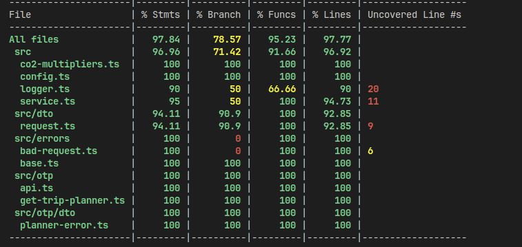

# MaaS
This document describes the MaaS API.

## Setup
This section describes how to set up the MaaS API.

### Prerequisites
The following software is required to build and deploy the MaaS API:

- [Node.js 18.x or later](https://nodejs.org/en/blog/release/v18.12.0)
- [AWS CDK 2.0 or later](https://docs.aws.amazon.com/cdk/v2/guide/cli.html)

### Build
To build the MaaS API, run the following command:

```bash
cd projects/ammended-trip
npm install
npm run build
```

### Deployment
To deploy the MaaS API, run the following command:

```bash
cd infra
npm install

export MAAS_OTP_URL="https://finland-staging.trip-planner.maas.global"
export MAAS_OTP_API_KEY="<your_key_here>"

cdk bootstrap
cdk deploy
```

Make sure to replace `<your_key_here>` with your own API key, and to have your AWS credentials set up correctly.

### Testing
To test the MaaS API, run the following command:

```bash
cd projects/ammended-trip
npm install
npm run test # or `npm run test:cov` for coverage
```

#### Current Coverage


### Linting
To lint the MaaS API, run the following command:

```bash
cd projects/ammended-trip
npm install
npm run lint # or `npm run lint:fix` to fix linting errors
```

## Libraries
This section describes the libraries used in the MaaS API.

 - [AWS CDK](https://docs.aws.amazon.com/cdk/latest/guide/home.html) - Infrastructure as code
 - TypeScript - I chose this instead of JavaScript because of its type safety. I also find it easier to read and write.
 - Jest - Testing framework
 - Axios - HTTP client
 - Winston - Logging
 - Other OS-agnostic libraries, such as `copyfiles`, `rimraf` and `npm-run-all` to build the project
 - ESLint + Prettier - Linting and code formatting

## Considerations & Possible Improvements
This section describes some possible improvements to the MaaS API that would make sense in a real-world scenario.

 - **Authentication** - Currently, the API is open to the public. In a real-world scenario, it would make sense to add authentication to the API, so that only authorized users can use it. This could be done using AWS Cognito, for example.
 - The documentation is currently very minimal. In a real-world scenario, it would make sense to add more documentation, such as a Swagger UI.
 - Use `zod` or similar libraries to validate the request parameters/body based on the JSON Schema / Swagger specifications.
 - Since CO2 emissions are constantly changing (even if very slowly), it would make sense to:
   - **The cheap solution** - Have them in ENV variables and redeploy rarely, e.g. once every few months.
   - **More expensive but by-the-book solution** - Have them in a database, and update them regularly. Options for databases with cheap and fast reads are DynamoDB and Redis
 - Improve error responses by providing JSON Schema / Swagger specifications for them. Also, errors should have a discriminator property, so that the client can easily determine what kind of error it is.
 - The given document does not elaborate on what inputs the endpoint should get. Currently I have assumed that the required inputs are `from` and `to` coordinates, and that the endpoint should return a plan with amended CO2 emissions. However, it would make sense to clarify this with the client as the OTP api also supports other inputs, such as `date` and `time`.
 - **Deployments** - Since OSs are very different and use different shells, it would make sense to have a deployment environment agnostic of the host OS. This could be done using Docker, for example.
 - **Infrastructure** - The values available in the `infra` folder are currently hardcoded to match my region and have low costs. In a real-world scenario, it would make sense to have these values configurable.

## API

### `GET /plan?from=<from>&to=<to>`
Returns a plan, with amended CO2 emissions, from the given `from` to the given `to` location, where `from` and `to` are comma-separated latitude and longitude coordinates.

Example: `GET /plan?from=12.3456,12.346&to=12.3457,12.348`

#### Responses
- `200 OK` with a JSON object containing the plan and amended CO2 emissions, as described in JSON schema provided.
```json
{
    "plan": {
        "from": {
            "coordinates": [
                24.987888,
                60.1481566
            ]
        },
        "to": {
            "coordinates": [
                24.8708367,
                60.1946199
            ]
        },
        "itineraries": [
            {
                "distance": 10688.07,
                "duration": 4115,
                "startTime": "2023-07-07T06:36:04.000Z",
                "endTime": "2023-07-07T07:44:39.000Z",
                "co2": 785,
                "legs": [
                    {
                        "mode": "WALK",
                        "distance": 275.2,
                        "co2": 0
                    },
                    {
                        "mode": "FERRY",
                        "routeShortName": "19",
                        "distance": 2710.91,
                        "co2": 390.37
                    },
                    {
                        "mode": "WALK",
                        "distance": 282.34,
                        "co2": 0
                    },
                    {
                        "mode": "TRAM",
                        "routeShortName": "4",
                        "distance": 7307.89,
                        "co2": 394.63
                    },
                    {
                        "mode": "WALK",
                        "distance": 111.73,
                        "co2": 0
                    }
                ]
            },
            {
                "distance": 10688.07,
                "duration": 3635,
                "startTime": "2023-07-07T06:56:04.000Z",
                "endTime": "2023-07-07T07:56:39.000Z",
                "co2": 785,
                "legs": [
                    {
                        "mode": "WALK",
                        "distance": 275.2,
                        "co2": 0
                    },
                    {
                        "mode": "FERRY",
                        "routeShortName": "19",
                        "distance": 2710.91,
                        "co2": 390.37
                    },
                    {
                        "mode": "WALK",
                        "distance": 282.34,
                        "co2": 0
                    },
                    {
                        "mode": "TRAM",
                        "routeShortName": "4",
                        "distance": 7307.89,
                        "co2": 394.63
                    },
                    {
                        "mode": "WALK",
                        "distance": 111.73,
                        "co2": 0
                    }
                ]
            },
            {
                "distance": 10688.07,
                "duration": 3875,
                "startTime": "2023-07-07T07:16:04.000Z",
                "endTime": "2023-07-07T08:20:39.000Z",
                "co2": 785,
                "legs": [
                    {
                        "mode": "WALK",
                        "distance": 275.2,
                        "co2": 0
                    },
                    {
                        "mode": "FERRY",
                        "routeShortName": "19",
                        "distance": 2710.91,
                        "co2": 390.37
                    },
                    {
                        "mode": "WALK",
                        "distance": 282.34,
                        "co2": 0
                    },
                    {
                        "mode": "TRAM",
                        "routeShortName": "4",
                        "distance": 7307.89,
                        "co2": 394.63
                    },
                    {
                        "mode": "WALK",
                        "distance": 111.73,
                        "co2": 0
                    }
                ]
            }
        ]
    }
}
```
- `400 Bad Request` if the request is malformed.
```json
{
    "message": "Human readable error message",
    "details": {
        ...
    }

}
```
- `500 Internal Server Error` if the server encountered an unexpected error.
```json
{
    "message": "Internal server error"
}
```

## My thoughts on the task
It was pretty interesting. I have never used AWS CDK before, only Terraform, so it was a nice opportunity to learn something new. I also have never used OTP before, so it was nice to learn something new there as well. I have used TypeScript, Jest and Axios before, so I was already familiar with those.